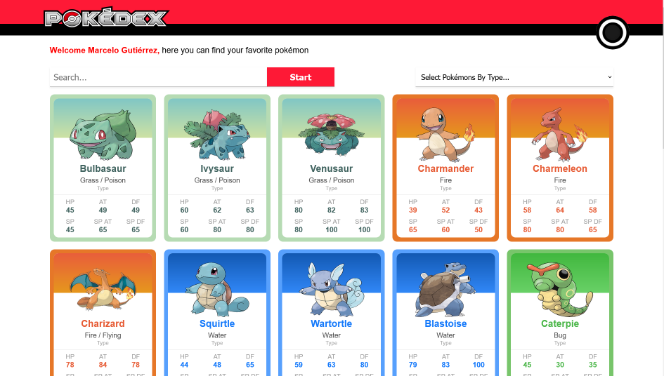

# Pokédex

Created using the [PokéAPI](https://pokeapi.co/), thanks!.  
Check out my app running on netlify here: <a href="https://pokedex-lemon-theta.vercel.app/" target="_blank">Pokédex</a>

## Screenshots



## Features

- Responsive Design
- Filter by type
- Searchbar for pokémon or pokémon id
- API consume

## Run Locally

Clone the project

```bash
  https://github.com/MarceloGtz/Pokedex.git
```

Go to the project directory

```bash
  cd Pokedex
```

Install dependencies

```bash
  npm install
```

Start the server

```bash
  npm run dev
```

## Tech Stack

- Html 5
- Css 3
- JavaScript
- React
- JSON
- API

## Acknowledgements

- [Readme Editor](https://readme.so/es)
- [PokéAPI](https://pokeapi.co/)
